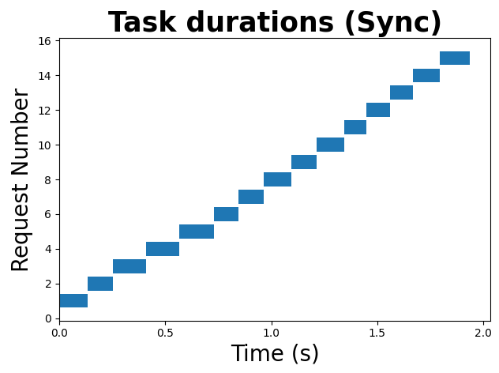

# Pyrallel: an exploration of Python's possibilities for concurrency and parallelism 

This project aims to explore different forms of concurrency and, when possible, parallelism, using
Python. Each explored form contains visual graphics, with the aid of Matplotlib, to show the achieved
performance benefits in terms of the reduction of the total computing time.

## Problem types

Some techniques may be better suited for some types of problems than others. Two main problems are included:

1. `I/O bound problems`: problems that are limited by the I/O systems such as hard drive disk accesses,
network requests, databases accesses, etc.

2. `CPU bound problems`: problems that are limited by the speed of the CPU such as mathematical computations like
matrices multiplications, summations, etc. 

Hence, the `problems` folder will contain these type of problems to test different algorithms against. 

## Explored algorithms

As the project grows, different techniques and strategies may be included. For starters, two main types of
algorithms are introduced:

1. Synchronous code (naive solutions);
2. Asynchronous code with multi-threading;
3. Asynchronous code with coroutines and event loops;
4. Parallel programming.

## Results

### 1. I/O BOUND: Sync

The program executed 15 requests and registered the total time of the sync project:



## Running the project

Just run the project locally (requires Python 3.7+)

```bash
python main.py
```

## Running tests

Run all the tests with pytest!

```bash
pytest -v
```